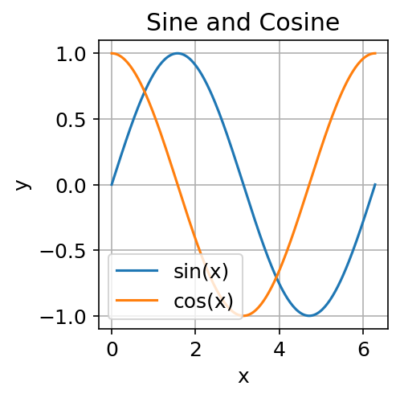
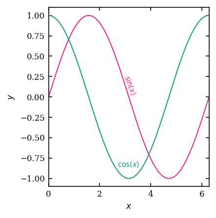

# Lesson 01: Figure Design Principles

A scientific figure has one job: to let the reader extract the result as quickly and accurately
as possible.
Every element that fails that job, unnecessary gridlines, duplicate legends, decorative 3D
effects, is in the way.
This lesson covers the principles that separate figures which communicate from figures which
merely display.

The two plots below show the same data. One applies every bad habit listed in this lesson;
the other follows the Nestling style guide.

| What not to do | What to do |
| :-: | :-: |
|  |  |
| Title inside panel, no units, outward ticks, framed legend | No title, LaTeX labels, inward mirror ticks, direct annotation |

!!! note "Acknowledgement"
    Several principles in this lesson are drawn from or inspired by Ciaran O'Hare's
    [HowToMakeAPlot](https://github.com/cajohare/HowToMakeAPlot), a concise, practical guide
    to scientific plotting in Python. It is well worth reading in full.

---

## The goal of a scientific figure

A figure should answer a specific question.
Before you open matplotlib, write down the question in one sentence:

> "What is the flux as a function of energy for these three models?"

If you cannot state the question, you are not ready to make the figure.
If the figure cannot be read by someone who knows the question, the figure has failed.

---

## Clarity

### Data-ink ratio

Edward Tufte introduced the concept of **data-ink ratio**: the fraction of the ink on a figure
that encodes data, as opposed to decoration.
The practical rule is: remove anything that does not carry information.

Common culprits:

| Element | Problem |
|---------|---------|
| Box around the plot | Already implied by axes; adds nothing |
| Grid lines (heavy) | Dominate the data; use only faint ones if needed for reading off values |
| 3D effects on bars or pies | Distort the data while adding no information |
| Redundant legend inside a panel with only one line | The label on the axis already names it |
| Excessively wide default margins | Waste space in multi-panel figures |

Removing these elements is not minimalism for its own sake. It reduces the cognitive load on
the reader and lets the data speak.

### Labels and units

Every axis must have a label.
Every label must include units.
"Energy" is not a label. "$E$ / GeV" is.

Use the same symbol in the label as in the body of the paper.
If the paper writes $\phi_\nu$, the axis should read $\phi_\nu$, not "flux".

### Tick marks

Ticks should face inward (into the plot area), not outward.
Ticks on both top and right edges (mirror ticks) are conventional in particle and astroparticle
physics and help the reader read off values without a grid.
The Nestling style enables this by default. See [Lesson 03](lesson-03.md).

### Font size

The default matplotlib font size (10 pt) is almost always too large relative to the figure size.
A figure destined for a single-column journal panel (roughly 88 mm wide) looks fine in a
notebook but becomes unreadable at print size.
Set font sizes to match the **printed** output, not the on-screen preview.
The Nestling style uses 8 pt throughout, which is legible at typical journal column widths.

---

## Honesty

### Aspect ratio and axis limits

The aspect ratio and axis limits control what the reader perceives as a "large" difference.
A factor-of-two change can look dramatic or negligible depending on axis choice.

- Never crop axes to exclude zero when the baseline matters, e.g., a bar chart where only the
  top 5 % is shown dramatically exaggerates differences.
- Log scales are appropriate for quantities that span orders of magnitude.
  Use them for energy spectra, flux, probability densities. Do not use them where the
  quantity has a natural zero that anchors the comparison.

### Error bars and uncertainty bands

Always show uncertainties.
If you show a fit, show the uncertainty on the fit.
If you show data, show the measurement uncertainty.
Choosing a plot range that excludes the large-error tails is acceptable only if this is stated
explicitly in the caption.

### Smoothing and binning

Changing the bin width of a histogram can make a distribution look smooth or noisy.
Changing the smoothing kernel of a continuous estimate can suppress or reveal features.
Neither choice is neutral, and neither should be invisible.
State binning and smoothing choices in the caption.

---

## Accessibility

### Colour

Do not rely on colour alone to distinguish curves or regions.
Roughly 8 % of men and 0.5 % of women have some form of colour vision deficiency.
Additionally, many readers encounter your figure in greyscale (printouts, black-and-white
preprints).

Two strategies that work together:

1. **Use a colourblind-friendly palette.** The Nestling style uses the Dark2 palette from
   [ColorBrewer](https://colorbrewer2.org/#type=qualitative&scheme=Dark2&n=6), which is
   distinguishable by the most common types of colour vision deficiency.

2. **Differentiate by line style or marker shape as well as colour.**
   Solid, dashed, and dotted lines are distinguishable without colour.
   Squares, circles, and triangles are distinguishable without colour.

### Font and contrast

Use a font with clear distinction between commonly confused characters (1/l/I, 0/O).
Avoid very light colours for text or axis labels. Ensure sufficient contrast with the
background.
The default white background with dark text is the safest choice for publication.

### Caption completeness

A figure caption should allow the reader to understand the figure without consulting the main
text.
It should state:

- What is shown (the quantity plotted).
- What data or model produced it.
- The meaning of each colour, line style, or marker.
- Any important caveats (smoothing, cuts, approximations).

---

## Common mistakes

| Mistake | Fix |
|---------|-----|
| Title inside the panel ("Flux vs Energy") | Remove it; the caption carries this |
| Legend font smaller than axis font | Match the sizes |
| Zero suppressed on bar chart | Start the y-axis at zero |
| Rasterised lines in a PDF figure | Save as vector (PDF/SVG) or use high DPI |
| Colours that clash or are indistinguishable | Switch to a ColorBrewer palette |
| Too many curves on one panel | Split into sub-panels |
| Marker size so small it is invisible at print scale | Test at the final print size |

---

## Checklist before submitting a figure

- [ ] Every axis has a label with units.
- [ ] Font sizes are legible at the final print size.
- [ ] Colours are distinguishable without relying on colour alone.
- [ ] No chartjunk (gridlines, boxes, 3D effects).
- [ ] Uncertainties are shown.
- [ ] The caption is self-contained.
- [ ] The file is saved in a vector format (PDF or SVG) or as a high-DPI raster (≥ 300 DPI).

---

## What to read next

[Lesson 02](lesson-02.md) turns these principles into code, covering the matplotlib API and
the most common plot types you will use in physics research.
